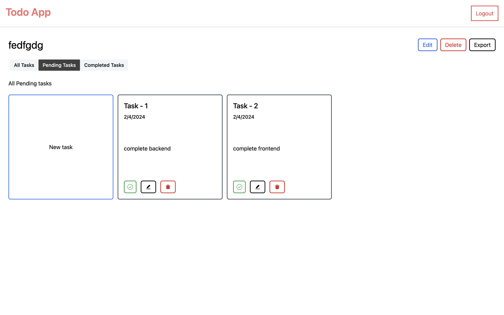
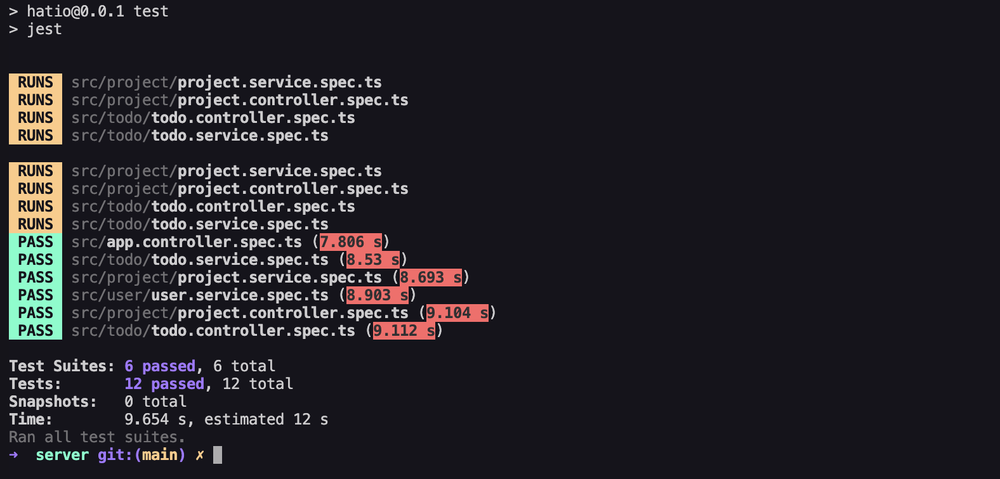
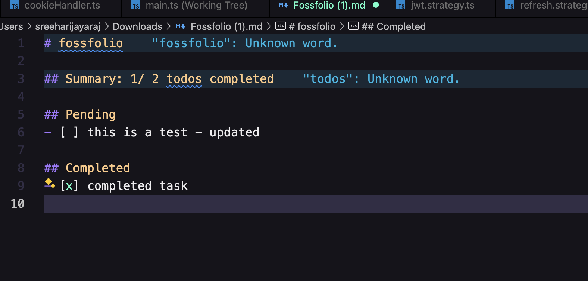

# Take home assignment for Hatio

## Todo App with Auth and Gist Support


##  <a href="https://sreehari-jayaraj.neetorecord.com/watch/649738f7-6813-4096-b0b3-1d00fb7e7f2a">Project walk through - Link</a>



### Tech Stack

- Frontend
  - Next Js + Typescript
- Backend
  - Nest Js + Typescript + PostgreSQL + Prisma 


## Run Locally


- Database
```bash

 docker compose up

```


- Frontend
```bash

 cd client
 pnpm install
 pnpm run dev

```

- Backend
```bash

 cd server
 pnpm install
 pnpm run start:dev

```

- Test
```bash

 cd server
 pnpm install
 pnpm run test

```

### Frontend

- Added zod for schema validation
- React hook form for form handling
- Radix ui for components


### Backend

- Added auth using passport js
- Added decorators to guard routes


### Things that can be improved

- More test coverage
- Add Test in frontend


### Features

- CRUD Todo
- Good Ui
- Skelton Loaders
- Auth with refresh tokens 


### Testing

- Right now i have only added test for service layer in backend
- Test in written using jest framework





### Generated Gist

